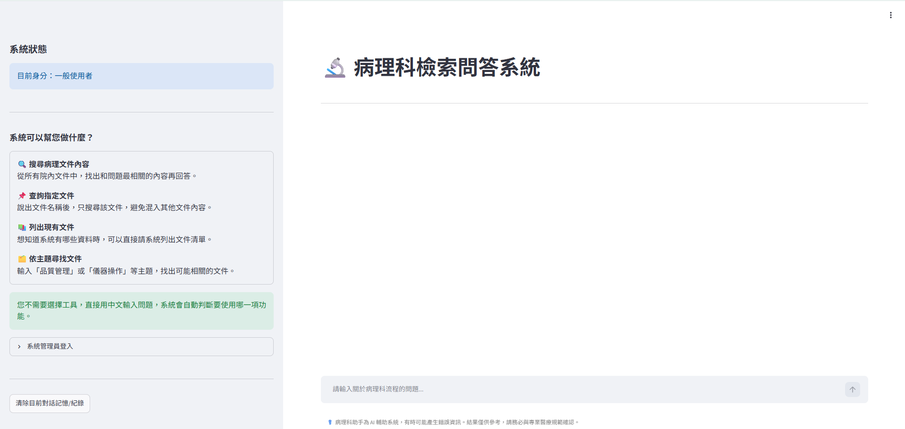
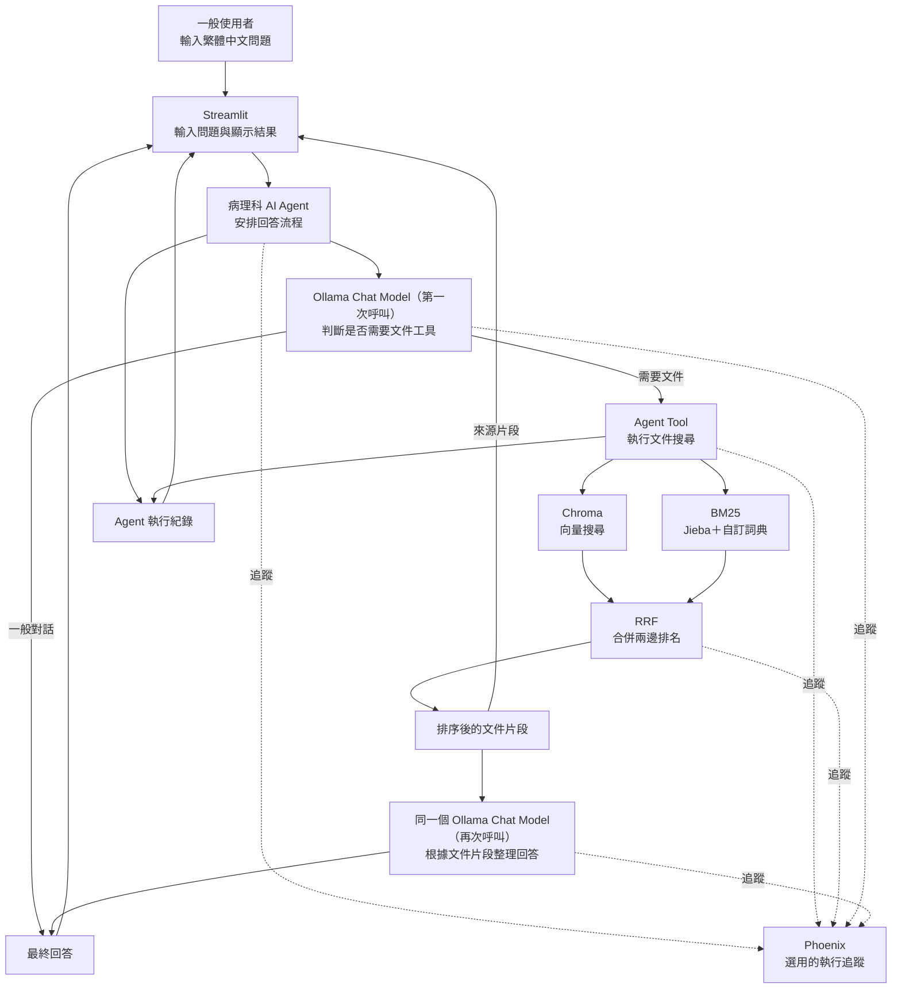

# 🔬 病理科 RAG + LLM Agent 檢索問答系統


以嘉義基督教醫院病理科內部文件為知識來源，結合本機大型語言模型
（LLM）、檢索增強生成（RAG）與 AI Agent，提供病理科流程、儀器、
管理規範及表單內容的文件檢索問答功能。

最新版本為 **v6**。全庫搜尋與指定文件搜尋使用 Chroma 向量搜尋加上
BM25 關鍵字搜尋，再由 RRF 合併兩邊排名；如果 BM25 暫時無法使用，
系統會自動退回純向量搜尋，不會阻擋問答。


## 🌟 專案目標

一般使用者不需要了解程式、向量資料庫、BM25 或 Agent Tool，只要直接
以繁體中文輸入問題，系統便會自動判斷適合的查詢方式，從已匯入的
病理科文件中找出相關內容，再由本機 LLM 整理回答。

本系統適合查詢：

- 病理科作業流程與標準作業程序。
- 儀器操作、維護及異常處理方式。
- 品質管理、文件管理及內部規範。
- 表單用途、填寫方式及相關規定。
- 目前知識庫有哪些文件。
- 搜尋特定主題文件。
- 指定某一份文件進行限定搜尋。

## 🌟 主要特色

- **本機 LLM：**透過 Ollama 執行聊天模型與 `bge-m3` 文字嵌入模型。
- **混合式 RAG 檢索：**結合 Chroma 語意搜尋與 BM25 關鍵字搜尋。
- **RRF 排名融合：**向量權重為 0.7、BM25 權重為 0.3，排名平滑常數為 `c=60`。
- **Jieba 中文斷詞：**搭配病理學、醫事檢驗及院內自訂詞彙，提高專業名詞命中率。
- **Agent 自動選擇工具：**使用者不需要手動決定搜尋方式。
- **限定文件搜尋：**可依完整或部分檔名，只搜尋指定文件。
- **多版本選擇：**檔名符合多份文件時，由使用者選擇正確版本。
- **主題文件搜尋：**以檔名比對加上向量搜尋，找出可能相關的文件。
- **失敗退回機制：**BM25 索引缺失、損壞或未同步時，自動改用純向量搜尋。
- **來源追蹤：**回答後可查看來源檔名與檢索片段；只有 PDF 顯示實際頁碼。
- **一般對話不顯示來源：**Agent 沒有使用文件工具時，不顯示無關的參考資料。
- **回答格式整理：**將模型輸出的 `<br>`、`<li>` 等常見 HTML 標籤轉成可閱讀格式。
- **串流回答：**逐段顯示模型回答與安全的 Agent 執行進度。
- **對話記憶：**可讓 Agent 參考近期對話，延續使用者問題。
- **管理員模式：**保護文件上傳、刪除、資料庫重建及參數設定。
- **多種文件格式：**支援 PDF、DOCX、DOC、CSV、XLS 與 XLSX。
- **同步更新：**一批文件上傳或刪除完成後，同步更新 Chroma 與 BM25。
- **Phoenix 追蹤：**可選擇記錄 Agent、檢索、LLM 與使用者回饋；未啟動時不影響問答。

## 🛠️ 系統架構



Chroma 擅長尋找意思相近的內容，BM25 擅長尋找明確關鍵字，RRF 則依
兩邊的排名合併結果，不會直接混合兩種不同尺度的分數。

文件匯入流程：

```text
原始文件
  → 格式讀取或轉檔
  → 清理多餘空白
  → 切成 600 字、重疊 150 字的共同文字片段
  ├─→ bge-m3 轉換為向量 → 寫入 Chroma
  └─→ Jieba＋自訂詞典斷詞 → 建立 BM25 索引
  → Chroma 與 BM25 使用相同的文字片段識別碼
  → 提供 Agent 混合檢索
```

全庫搜尋與指定文件搜尋使用 Chroma＋BM25 混合檢索。主題文件搜尋
維持「檔名比對＋向量搜尋」，不使用 BM25 排名。

## Agent Tool

系統提供四個工具，由 Agent 依照問題內容自動選擇：

| 工具 | 白話說明 | 使用情境 |
|---|---|---|
| `search_pathology_documents` | 以 Chroma＋BM25 搜尋全部病理文件內容 | 詢問流程、規範、儀器或表單內容，且沒有指定文件 |
| `search_specific_document` | 以 Chroma＋BM25 只搜尋指定文件 | 問題中提到檔名，或使用者已選定某份文件 |
| `list_pathology_documents` | 列出目前所有文件 | 詢問「系統有哪些文件」 |
| `find_pathology_documents_by_topic` | 以檔名比對＋向量搜尋尋找相關文件 | 詢問「有哪些品質管理相關文件」 |

一般使用者不需要輸入工具名稱，也不需要自行決定使用哪一個工具。

## 📂 專案檔案

```text
agent_v6/
├─ 0725_rag_agent_v6.py       # v6 Streamlit 主程式
├─ agent_core_v6.py           # LLM、Agent、Tool 與執行事件
├─ rag_core_v6.py             # 文件處理、共同切塊與 Chroma
├─ hybrid_retriever_v6.py     # Chroma＋BM25 的 RRF 混合檢索
├─ bm25_index_v6.py           # Jieba 詞典、BM25 索引與關鍵字搜尋
├─ build_bm25_index_v6.py     # 讀取文件、共同切塊與重建 BM25
├─ phoenix_tracing_v6.py      # 可選用的 Phoenix 執行追蹤
├─ requirements_v6.txt        # v6 Python 套件版本
├─ BM25/
│  ├─ 病理學名詞壓縮檔_0.ods
│  └─ 醫學名詞-醫事檢驗名詞壓縮檔_0.ods
├─ 01_processed_data/         # 執行時使用；存放可檢索文件
├─ 02_db/
│  ├─ chroma_db/              # 執行時建立；存放向量資料庫
│  └─ bm25_db/
│     └─ index.json           # 執行時建立；存放 BM25 索引
└─ .streamlit/
   └─ secrets.toml            # 本機建立；存放管理員密碼
```

七個 v6 程式模組的分工：

- `0725_rag_agent_v6.py`
  - Streamlit 網頁與聊天介面。
  - 管理員登入及檔案管理。
  - 模型、檢索及記憶參數。
  - Agent 串流事件、回答、來源與使用者回饋顯示。

- `agent_core_v6.py`
  - 建立並快取 Ollama 對話模型。
  - 建立病理科 Agent 與四種 Agent Tool。
  - 執行全庫、指定文件與主題文件搜尋。
  - 保存檢索結果、限定文件狀態及安全的執行紀錄。
  - 整理 LLM 回傳的常見 HTML 換行與清單格式。

- `rag_core_v6.py`
  - 管理處理後的實體文件。
  - 取得 Chroma 向量資料庫。
  - 使用共同文字片段新增、刪除或重建 Chroma。
  - 在文件變更後呼叫 BM25 同步重建。

- `hybrid_retriever_v6.py`
  - 將 Chroma 與 BM25 包裝成可共同使用的檢索器。
  - 使用 RRF 合併向量與關鍵字排名。
  - 統一結果識別碼並避免相同文字片段重複出現。
  - BM25 不可用時提供純向量搜尋退回機制。

- `bm25_index_v6.py`
  - 載入病理學、醫事檢驗及院內自訂詞彙。
  - 使用 Jieba 進行中文斷詞。
  - 建立、儲存、載入與搜尋 BM25 索引。

- `build_bm25_index_v6.py`
  - 讀取 PDF、DOCX 與 CSV。
  - 將文件切成 Chroma 與 BM25 共用的文字片段。
  - 呼叫 BM25 核心建立 `index.json` 與詞典紀錄。

- `phoenix_tracing_v6.py`
  - 記錄 Agent、Tool、Retriever 與 LLM 執行狀態。
  - 記錄 Chroma、BM25、RRF 排名及使用者回饋。
  - Phoenix 未安裝、未啟動或已停用時，不阻擋主要問答功能。


## 使用方式

### 一般使用者

直接在聊天輸入框輸入問題，例如：

```text
檢體簽收的處理流程是什麼？
```

```text
肺癌相關規範有哪些？
```

```text
目前系統有哪些文件？
```

```text
有哪些和品質管理相關的文件？
```

```text
請在「某某儀器操作規範.pdf」中查詢每日保養步驟。
```

系統會自動：

1. 判斷問題是否需要文件工具。
2. 選擇搜尋全部文件、指定文件、文件清單或主題文件。
3. 全庫與指定文件搜尋同時取得向量及 BM25 候選結果。
4. 使用 RRF 合併排名，再取回設定數量的文字片段。
5. 根據文件內容產生繁體中文回答。
6. 只有實際使用文件檢索時，才顯示來源檔名與文字片段。

### 管理員

在側邊欄展開「系統管理員登入」，輸入
`.streamlit/secrets.toml` 設定的密碼。

管理員可以：

- 上傳及匯入病理科文件。
- 刪除實體文件與對應的 Chroma 文字片段。
- 在一批文件處理完成後同步重建 BM25。
- 強制重新建立整個 Chroma 與 BM25 資料庫。
- 查看 BM25 是否可用、文件數量及同步狀態。
- 查看 Phoenix 是否連線；未連線時問答仍可使用。
- 暫時調整 LLM、向量相似度門檻、檢索數量及對話記憶。

每次登入管理員模式時，參數會套用以下預設：

| 參數 | 預設值 |
|---|---|
| LLM 模型 | `gpt-oss:20b` |
| 向量相似度門檻 | `0.30` |
| 最終檢索文本數量 | `4` |
| 向量／BM25 權重 | `0.7／0.3` |
| RRF 排名平滑常數 | `60` |
| 記憶模式 | 開啟 |
| 對話記憶輪數 | `3` |

管理員可在本次登入期間暫時修改畫面提供的參數；登出時會恢復預設，
下次登入仍從預設值開始。向量／BM25 權重與 RRF 常數目前固定在程式中，
不會出現在一般管理員調整介面。

## 支援的文件格式

| 上傳格式 | 處理方式 |
|---|---|
| PDF | 直接擷取每頁文字並保留頁碼 |
| DOCX | 擷取 Word 純文字；來源畫面不顯示不可靠的頁碼 |
| DOC | 使用 LibreOffice 在背景轉成 DOCX |
| CSV | 使用 UTF-8-SIG 讀取，降低繁體中文亂碼 |
| XLS、XLSX | 每個有效工作表分別轉成 CSV |

文字切塊預設：

- 每個文字塊最多約 600 個字元。
- 相鄰文字塊重疊 150 個字元。
- 優先依段落、換行、句號、分號及空白切割。
- Chroma 與 BM25 使用完全相同的文字片段與穩定識別碼。

BM25 自訂詞典來源：

- 樂詞網病理學名詞。
- 樂詞網醫事檢驗名詞。

修改詞典、切塊方式或知識庫文件後，必須重新建立 BM25 索引；管理員
執行強制重建時，系統會同時重建 Chroma 與 BM25，確保兩邊資料一致。
