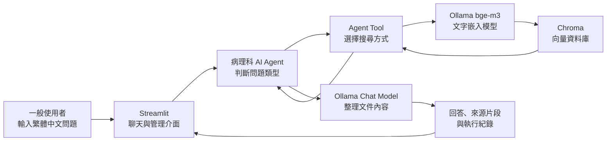

# 病理科 RAG + LLM Agent 檢索問答系統

以嘉義基督教醫院病理科內部文件為知識來源，結合本機大型語言模型
（LLM）、檢索增強生成（RAG）與 AI Agent，提供病理科流程、儀器、
管理規範及表單內容的文件檢索問答功能。

最新版本為 **v5.1**。


## 專案目標

一般使用者不需要了解程式、向量資料庫或 Agent Tool，只要直接以
繁體中文輸入問題，系統便會自動判斷適合的查詢方式，從已匯入的
病理科文件中找出相關內容，再由本機 LLM 整理回答。

本系統適合查詢：

- 病理科作業流程與標準作業程序。
- 儀器操作、維護及異常處理方式。
- 品質管理、文件管理及內部規範。
- 表單用途、填寫方式及相關規定。
- 目前知識庫有哪些文件。
- 哪些文件可能與特定主題有關。
- 指定某一份文件進行限定搜尋。

## 主要特色

- **本機 LLM：**透過 Ollama 執行聊天模型與文字嵌入模型。
- **RAG 文件檢索：**使用 Chroma 儲存向量並搜尋相關文件片段。
- **Agent 自動選擇工具：**使用者不需要手動選擇搜尋方式。
- **限定文件搜尋：**可依完整或部分檔名，只搜尋指定文件。
- **多版本選擇：**檔名符合多份文件時，由使用者選擇正確版本。
- **來源追蹤：**回答後可查看來源檔名、文件片段及 PDF 頁碼。
- **串流回答：**逐段顯示模型回答與安全的 Agent 執行進度。
- **對話記憶：**可讓 Agent 參考近期對話，延續使用者問題。
- **管理員模式：**保護文件上傳、刪除、資料庫重建及參數設定。
- **多種文件格式：**支援 PDF、DOCX、DOC、CSV、XLS 與 XLSX。
- **局部更新：**新增或刪除單一文件時，不必每次重建全部資料庫。

## 系統架構



文件匯入流程：

```text
原始文件
  → 格式讀取或轉檔
  → 清理多餘空白
  → 切成文字片段
  → bge-m3 轉換為向量
  → 寫入 Chroma
  → 提供 Agent 語意搜尋
```

## Agent Tool

系統提供四個工具，由 Agent 依照問題內容自動選擇：

| 工具 | 白話說明 | 使用情境 |
|---|---|---|
| `search_pathology_documents` | 搜尋全部病理文件內容 | 詢問流程、規範、儀器或表單內容，且沒有指定文件 |
| `search_specific_document` | 只搜尋指定文件 | 問題中提到檔名，或使用者已選定某份文件 |
| `list_pathology_documents` | 列出目前所有文件 | 詢問「系統有哪些文件」 |
| `find_pathology_documents_by_topic` | 依主題尋找可能相關的文件 | 詢問「有哪些品質管理相關文件」 |

一般使用者不需要輸入工具名稱，也不需要自行決定使用哪一個工具。

## 專案檔案

```text
agent_v5/
├─ 0725_rag_agent_v5_1.py    # v5.1 Streamlit 主程式
├─ agent_core_v5_1.py        # LLM、Agent、Tool 與執行事件
├─ rag_core_v5_1.py          # 文件處理、切塊與 Chroma
├─ 01_processed_data/        # 執行時建立；存放可檢索文件
├─ 02_db/
│  └─ chroma_db/             # 執行時建立；存放向量資料庫
└─ .streamlit/
   └─ secrets.toml           # 本機建立；存放管理員密碼
```

三個 v5.1 模組的分工：

- `0725_rag_agent_v5_1.py`
  - Streamlit 網頁與聊天介面。
  - 管理員登入及檔案管理。
  - 模型、檢索及記憶參數。
  - Agent 串流事件與回答顯示。
  - 聊天歷史、來源及限定文件狀態。

- `agent_core_v5_1.py`
  - 建立並快取 Ollama 對話模型。
  - 建立病理科 Agent 與系統提示詞。
  - 定義四種 Agent Tool。
  - 保存檢索結果及限定文件狀態。
  - 建立可公開顯示的 Agent 執行紀錄。

- `rag_core_v5_1.py`
  - 載入 PDF、DOCX 與 CSV。
  - 清理文件文字。
  - 將文件切成文字片段。
  - 呼叫 `bge-m3` 產生文字向量。
  - 新增、刪除或重建 Chroma 資料庫。


## 使用方式

### 一般使用者

直接在聊天輸入框輸入問題，例如：

```text
檢體簽收的處理流程是什麼？
```

```text
目前系統有哪些文件？
```

```text
有哪些和品質管理相關的文件？
```

```text
請在「某某儀器操作規範.pdf」中查詢每日保養步驟。
```

系統會自動：

1. 判斷問題需要哪一種工具。
2. 搜尋全部文件、指定文件或文件名稱。
3. 取得符合門檻的文字片段。
4. 根據文件內容產生繁體中文回答。
5. 顯示來源檔名、頁碼及實際檢索片段。

### 管理員

在側邊欄展開「系統管理員登入」，輸入
`.streamlit/secrets.toml` 設定的密碼。

管理員可以：

- 上傳及匯入病理科文件。
- 刪除實體文件與對應的向量文字塊。
- 強制重新建立整個 Chroma 資料庫。
- 暫時調整 LLM、相似度門檻、檢索數量及對話記憶。

每次登入管理員模式時，參數會套用以下預設：

| 參數 | 預設值 |
|---|---|
| LLM 模型 | `gpt-oss:20b` |
| 檢索相似度門檻 | `0.30` |
| 檢索文本數量 | `4` |
| 記憶模式 | 開啟 |
| 對話記憶輪數 | `3` |

管理員可在本次登入期間暫時修改參數；登出時會全部恢復預設，
下次登入仍從預設值開始。

## 支援的文件格式

| 上傳格式 | 處理方式 |
|---|---|
| PDF | 直接擷取每頁文字並保留頁碼 |
| DOCX | 擷取 Word 純文字 |
| DOC | 使用 LibreOffice 在背景轉成 DOCX |
| CSV | 使用 UTF-8-SIG 讀取，降低繁體中文亂碼 |
| XLS、XLSX | 每個有效工作表分別轉成 CSV |

文字切塊預設：

- 每個文字塊最多約 600 個字元。
- 相鄰文字塊重疊 150 個字元。
- 優先依段落、換行、句號、逗號及空白切割。


